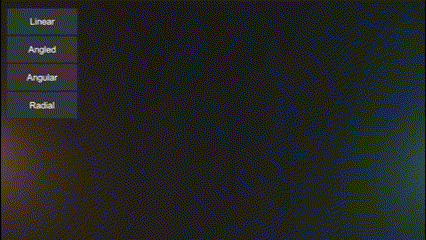

# Sweep Effects

Animating effect timings based on an effect's position in the scene.

## Features

- Create Scriptable Objects for animations with various timings and speeds
- Easily create and script new effects

## Outside Dependencies

- The sample scene requires the free asset [HOTween](https://assetstore.unity.com/packages/tools/animation/dotween-hotween-v2-27676#description)

## Installation

### Using Unity Package Manager

1. Go to **Window > Package Manager**.
3. Click the **+** button in the top-left corner.
4. Select **Add package from git URL...**.
5. Enter the following URL: https://github.com/ElliottHood/Sweep-Effects.git